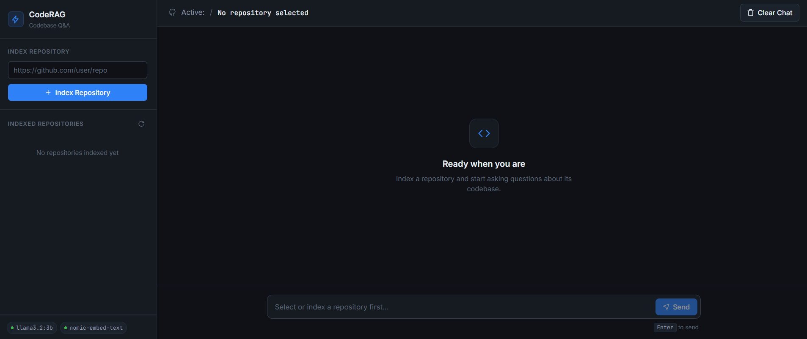

# CodeRAG — Codebase Q&A with Local LLM

Ask questions about any GitHub repository using a fully local RAG pipeline.
No API keys. No cloud. Everything runs on your machine.


## 🚀 Try It Now (Live)

**CodeRAG is now live!** Access it instantly without any setup:

**[🌐 Open CodeRAG Live](https://huggingface.co/spaces/malankabuilder/CodeRAG)**

Or run it locally on your machine with the setup instructions below.

## What It Does

1. Paste a GitHub repo URL → CodeRAG clones and indexes the codebase
2. Embeddings generated locally via `nomic-embed-text` (Ollama)
3. Vectors stored in ChromaDB (persistent, on-disk)
4. Ask any question → top-k relevant chunks retrieved → `llama3.2:3b` answers with context
5. Sources shown for every answer — no hallucinated file paths

## Demo

> "What API endpoints are defined in this project and what do they do?"



## Tech Stack

| Layer | Technology |
|---|---|
| LLM | Llama 3.2 3B via Ollama (runs on GPU/CPU locally) |
| Embeddings | nomic-embed-text via Ollama |
| Vector Store | ChromaDB (persistent, local) |
| Orchestration | LangChain |
| Backend | FastAPI |
| Frontend | HTML / CSS / JS |

## Project Structure

```
CodeRAG/
├── app/
│   ├── api/
│   │   └── routes.py        # /ingest, /ask, /collections endpoints
│   ├── core/
│   │   └── config.py        # settings via pydantic-settings
│   ├── services/
│   │   ├── repo_loader.py   # clone repo, parse supported file types
│   │   ├── vectorstore.py   # chunk, embed, store/load ChromaDB
│   │   └── rag.py           # retrieve context, query LLM
│   └── main.py              # FastAPI app, serves frontend
├── frontend/
│   └── index.html           # chat UI
├── requirements.txt
└── .env
```

## Setup & Run

### Option 1: Use Live Version (Recommended - No Setup Required)
Simply visit **[https://huggingface.co/spaces/malankabuilder/CodeRAG](https://huggingface.co/spaces/malankabuilder/CodeRAG)** to start using CodeRAG instantly. No installation needed!

### Option 2: Run Locally

**Prerequisites**
- Python 3.11+
- [Ollama](https://ollama.com/download) installed and running
- Git

#### 1. Clone the repo
```bash
git clone https://github.com/malankatharula/CodeRAG.git
cd CodeRAG
```

#### 2. Install Ollama models
```bash
ollama pull llama3.2:3b
ollama pull nomic-embed-text
```

#### 3. Create virtual environment
```bash
python -m venv venv
venv\Scripts\activate        # Windows
source venv/bin/activate     # Linux/Mac
pip install -r requirements.txt
```

#### 4. Configure environment
```bash
cp .env.example .env
```

`.env` defaults:
```
OLLAMA_BASE_URL=http://127.0.0.1:11434
LLM_MODEL=llama3.2:3b
EMBED_MODEL=nomic-embed-text
CHROMA_PATH=./chroma_db
```

#### 5. Start Ollama (admin terminal on Windows)
```bash
ollama serve
```

#### 6. Run the app
```bash
uvicorn app.main:app --reload --port 8000
```

Open `http://127.0.0.1:8000`

## API Endpoints

| Method | Endpoint | Description |
|---|---|---|
| POST | `/api/ingest` | Clone and index a GitHub repo |
| POST | `/api/ask` | Ask a question about an indexed repo |
| GET | `/api/collections` | List all indexed repos |
| GET | `/api/health` | Health check |

## How RAG Works Here

**Chunking strategy** - code-aware splitting using `RecursiveCharacterTextSplitter` with separators prioritising class and function boundaries (`\nclass `, `\ndef `) before falling back to line and character splits. Chunk size 1000, overlap 150.

**Retrieval** - top-5 most semantically similar chunks retrieved per query using cosine similarity over nomic-embed-text embeddings.

**Generation** -  retrieved chunks passed as context to Llama 3.2 3B with a strict system prompt: answer only from context, cite files, say so if the answer isn't there.

## Supported File Types

`.py` `.js` `.ts` `.java` `.cpp` `.c` `.h` `.go` `.rs` `.rb` `.php` `.cs` `.md` `.txt` `.yaml` `.yml` `.toml` `.json` `.sh`

## Author

**Malanka Tharula Wickramasinghe**
[LinkedIn](https://linkedin.com/in/malanka-tharula-b329432a7) · [GitHub](https://github.com/malankatharula)